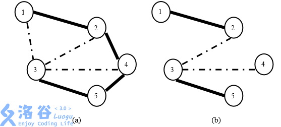

# P3623 [APIO2008]免费道路

## 题目描述

新亚（New Asia）王国有 N 个村庄，由 M 条道路连接。其中一些道路是鹅卵石路，而其它道路是水泥路。保持道路免费运行需要一大笔费用，并且看上去 王国不可能保持所有道路免费。为此亟待制定一个新的道路维护计划。

国王已决定保持尽可能少的道路免费，但是两个不同的村庄之间都应该一条且仅由一条 且仅由一条免费道路的路径连接。同时，虽然水泥路更适合现代交通的需 要，但国王也认为走在鹅卵石路上是一件有趣的事情。所以，国王决定保持刚好 K 条鹅卵石路免费。

举例来说，假定新亚王国的村庄和道路如图 3(a)所示。如果国王希望保持两 条鹅卵石路免费，那么可以如图 3(b)中那样保持道路(1, 2)、(2, 3)、(3, 4)和(3, 5) 免费。该方案满足了国王的要求，因为：(1)两个村庄之间都有一条由免费道 路组成的路径；(2)免费的道路已尽可能少；(3)方案中刚好有两条鹅卵石道路 (2, 3)和(3, 4)



图 3: (a)新亚王国中村庄和道路的一个示例。实线标注的是水泥路，虚线标注 的是鹅卵石路。(b)一个保持两条鹅卵石路免费的维护方案。图中仅标出了免 费道路。

给定一个关于新亚王国村庄和道路的述以及国王决定保持免费的鹅卵石 道路数目，写一个程序确定是否存在一个道路维护计划以满足国王的要求，如果 存在则任意输出一个方案。

## 输入格式

输入第一行包含三个由空格隔开的整数：

N，村庄的数目(1≤N≤20,000)；

M，道路的数目(1≤M≤100,000)；

K，国王希望保持免费的鹅卵石道路数目(0≤K≤N - 1)。

此后 M 行述了新亚王国的道路，编号分别为 1 到 M。第(i+1)行述了第 i 条 道路的情况。用 3 个由空格隔开的整数述：

ui 和 vi，为第 i 条道路连接的两个村庄的编号，村庄编号为 1 到 N；

ci，表示第 i 条道路的类型。ci = 0 表示第 i 条道路是鹅卵石路，ci = 1 表 示第 i 条道路是水泥路。

输入数据保证一对村庄之间至多有一条道路连接

## 输出格式

如果满足国王要求的道路维护方案不存在，你的程序应该在输出第一行打印 no solution。 否则，你的程序应该输出一个符合要求的道路维护方案，也就是保持免费的 道路列表。按照输入中给定的那样输出免费的道路。如果有多种合法方案，你可 以任意输出一种。

## 输入输出样例

**输入 #1**

```
5 7 2 
1 3 0 
4 5 1 
3 2 0 
5 3 1 
4 3 0 
1 2 1 
4 2 1
```

**输出 #1**

```
3 2 0 
4 3 0 
5 3 1 
1 2 1 
```

## 解题

```C++
#include<bits/stdc++.h>
#define ll long long
#define fr(i,n) for(int i=0;i<n;i++)
#define frr(i,j,n) for(int i=j;i<n;i++)
#define yes "yes"
#define no  "no"
using namespace std;

struct node{
    int a,b,c;
}nodes[100005];

int f[20004];

int getf(int t){
    if(f[t]==t) return t;
    return f[t] = getf(f[t]);
}

bool mergew(int a,int b){
    int t1 = getf(a);
    int t2 = getf(b);
    if(t1==t2) return false;
    f[t1] = t2;
    return true;
}

int main(){


    cin.tie(0);


    int n,m,k;//点，边，最低鹅软石连通数
    while(cin>>n>>m>>k){
        //[1,m]
        frr(i,1,n+1)    f[i] = i;
        frr(i,1,m+1)    cin>>nodes[i].a>>nodes[i].b>>nodes[i].c;
        //要求有k个鹅软石的最小生成树
        /*
            首先一个条件是保证有k个鹅软石，然后保证连通
            可以先连k个鹅卵石 然后再用石子路补充

            鹅卵石路的选择错误可能导致最后无法连通，一些鹅卵石路是必选一些是可选
            可以先优先使用石子路跑一遍，保证连通的情况下选出必须用的鹅卵石路

            然后再优先连接必须的鹅卵石路 如果第一遍连通那么这一次也可以保证一定连通，剩下的鹅卵石路随便选
            再用石子路填补

            最后判断
        */
        //1水泥 0鹅软石

        //第一次kru先连通水泥路，提出必须连的鹅软石路
        sort(nodes+1,nodes+m+1,[](node a,node b){
            return a.c>b.c;
        });
        int hasl = 0;

        for(int i=1;i<=m&&hasl<n-1;i++){
            bool hs = mergew(nodes[i].a,nodes[i].b);
            if(hs){
                hasl++;
                if(!nodes[i].c) nodes[i].c=-1;
                /*
                    必须用的鹅软石路标记为-1
                */
            }
        }

        //如果无限制连接都无法连通则直接报错
        if(hasl!=n-1){
            cout<<"no solution"<<endl;
            break;
        }

        //第二次kru

        //逆转优先度连接  标记的鹅卵石>鹅卵石>水泥
        sort(nodes+1,nodes+m+1,[](node a,node b){
            return a.c<b.c;
        });

        //frr(i,1,m+1)    cout<<nodes[i].a<<" "<<nodes[i].b<<" "<<nodes[i].c<<endl;

        frr(i,1,n+1)    f[i] = i;
        hasl = 0;
        int countof0 = 0;
        stringstream tmp;
        for(int i=1;i<=m&&hasl<n-1;i++){
            if(countof0==k&&nodes[i].c==0) continue;
            bool hs = mergew(nodes[i].a,nodes[i].b);
            if(hs){
                hasl++;
                if(nodes[i].c<1)    {countof0++;nodes[i].c=0;}
                /*
                    输出之前记得把标记去掉
                */
                tmp<<nodes[i].a<<" "<<nodes[i].b<<" "<<nodes[i].c<<endl;
            }
        }

        if(hasl!=n-1||countof0!=k){
            cout<<"no solution"<<endl;
            break;
        }else{
            cout<<tmp.str();
        }
    }

    return 0;
}

```

