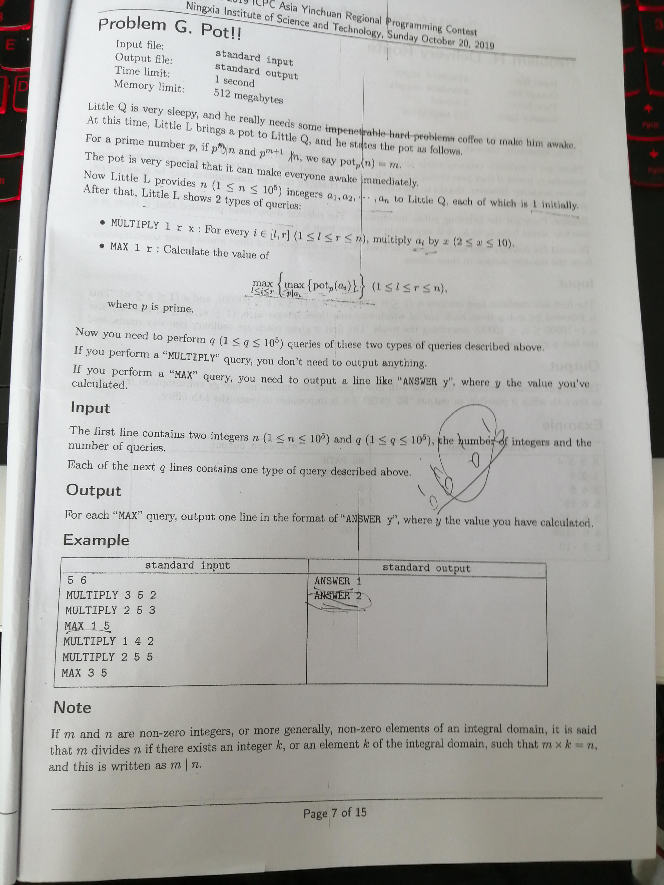

# ICPC2019银川G题

### 题面



### 题解

* 从题面可直接看出这是一道线段树题，

* 仔细思考可以发现，**pot~p~(n)的值就是n可以最多分出几个p因子**，例如40 = 5*2^3^  ,pot~2~(40) = 3

* a~i~的初始值为1，之后反复乘以x（2<=x<=10),a的因子都是从x乘来的，所以素因子只有2~x=(2,4,6,8,10)~,3~x=(3,6,9)~,5~x=(5,10)~,7~x=(7)~

* 查询的值即为在[l,r]内4种素因子单点计数的最大值，所以只要用4棵线段树分别动态维护4种素因子的区间最大计数即可

```c++
#include<bits/stdc++.h>
#define fr(i,n)	for(int i=0;i<n;i++)
using namespace std;

#define Tree_Max_Size 10005
struct segment_tree_node{
    int l,r;
    int w;
    int lazy;
};


class segment_tree{
private:
    segment_tree_node tree[Tree_Max_Size];
public:
    segment_tree(int l,int r,int v=0,int k = 1){Build(l,r,v,k);}

    void Build(int l,int r,int v=0,int k = 1){
        tree[k].l=l;
        tree[k].r=r;
        tree[k].lazy=0;
        if(l==r){
            tree[k].w=v;
        }else{
            Build(l,(l+r)>>1,k<<1);
            Build((l+r)/>>1|1,r,k<<1|1);
            tree[k].w = PushUp(tree[k<<1].w,tree[k<<1|1].w);
        }
    }

    void Update(int l,int r,int w,int k = 1){
        /*lazy*/
        if(tree[k].l==l&&tree[k].r==r){
            //只更新大段
            tree[k].w += w;
            //子段的更新存入缓存等需要的时候再进行
            tree[k].lazy += w;
        }else if(tree[k].l==tree[k].l){
            //到达叶子
            tree[k].w += w;
        }else{
            PushDown(k);
            int mid = (tree[k].l+tree[k].r)>>1;
            if(l<=mid)
                Update(l,mid,w,k<<1);
            if(mid+1<=r)
                Update(mid+1,r,w,k<<1|1);
            tree[k].w = PushUp(tree[k<<1].w,tree[k<<1|1].w);
        }
    }

    int Inquire(int l,int r,int k = 1){
        if(tree[k].l==l&&tree[k].r==r){
            return tree[k].w;
        }else if(tree[k].l==tree[k].r){
            return tree[k].w;
        }else{
            PushDown(k);
            int mid = (tree[k].l+tree[k].r)>>1;
            int lw = 0,rw = 0;
            if(l<=mid)
                lw = Inquire(l,mid,k<<1);
            if(mid+1<=r)
                rw = Inquire(mid+1,r,k<<1|1);
            return PushUp(lw,rw);
        }
    }

    /*PushDown 更新子段的值和lazy*/
    void PushDown(int k){
        //将lazy向下传递
        tree[k<<1].lazy += tree[k].lazy;
        tree[k<<1].w += tree[k].lazy;
        tree[k<<1|1].lazy += tree[k].lazy;
        tree[k<<1|1].w += tree[k].lazy;
        //清空传递完的lazy
        tree[k].lazy = 0;
    }

    /*PushUp*/
    int PushUp(int w1,int w2){
        //return w1+w2;
        //return w1*w2;
        return max(w1,w2);
    }
};

int main(){
    int n,q;
    while(cin>>n>>q){
        segment_tree a2(0,n);
        segment_tree a3(0,n);
        segment_tree a5(0,n);
        segment_tree a7(0,n);
        fr(i,q){
           	char inp[20];
            int l,r,x;
            scanf("%s %d %d",inp,&l,&r);
            if(strcmp(inp,"1")!=0){
                scanf("%d",&x);
            	if(x==2)	    a2.Update(l,r,1);		//2
                else if(x==3)	a3.Update(l,r,1);	//3
                else if(x==4)	a2.Update(l,r,2);	//2 2
                else if(x==5)	a5.Update(l,r,1);	//5
                else if(x==6){	a2.Update(l,r,1);a3.Update(l,r,1);}	//2 3
                else if(x==7)	a7.Update(l,r,1);	//7
                else if(x==8)	a2.Update(l,r,3);	//2 2 2
                else if(x==9)	a3.Update(l,r,3);	//3 3 3
                else if(x==10){	a2.Update(l,r,1);a5.Update(l,r,1);}	//2 5
            }else{
                printf("ANSWER %d %d %d %d\n",a2.Inquire(l,r),a3.Inquire(l,r),a5.Inquire(l,r),a7.Inquire(l,r));
            }
        }
    }
}

```

---


